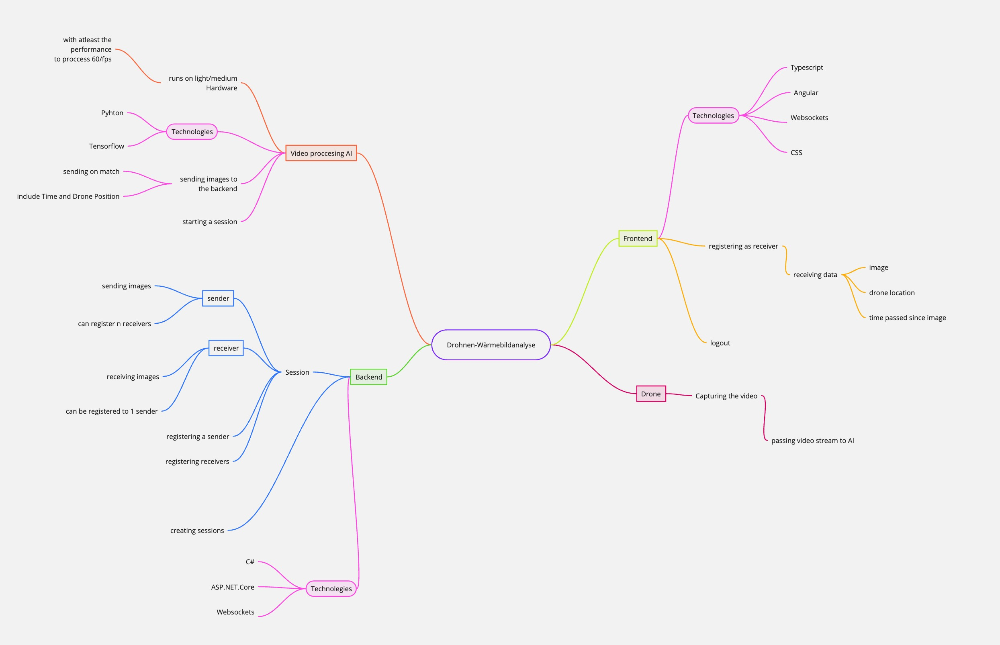

# Projektantrag - Drohnen-Wärmebildanalyse

## 1. Ausgangslage

### 1.1. Ist-Situation

Das Rote Kreuz verwendet Drohnen, um vermisste Personen mithilfe von Wärmebildaufnahmen ausfindig zu machen. Dabei müssen die Piloten die Drohnen steuern und dabei ein aktives Auge auf die Übertragung werfen.

Die FH hatte bereits ein Projekt, das mehrere Bilder mithilfe von Integralbildtechnologie und KI analysiert und Menschen ausfindig macht.

### 1.2. Verbesserungspotenziale

Das Rotes Kreuz braucht ein Framework um das KI model aktiv mit ihren drohnen verknüpft und mithilfe eines Interfacesanzeigt. DAs ist technisch ziemlich kompliziert, da die KI sehr viele ressourcen benötigt.

## 2. Zielsetzung

## 3. Chancen und Risiken

> :bulb: **Hinweise:**
>
> - Welchen Nutzen hat Ihr vorgeschlagenes System für die strategische Ausrichtung der Firma?
> - Mit welchen konkreten Projektrisiken muss man rechnen?

## 4. Planung

> :bulb: **Hinweise:**
>
> - Klären Sie personelle und finanzielle Rahmenbedingungen.
> - Definieren Sie grobe Meilensteine für die Projektumsetzung.
