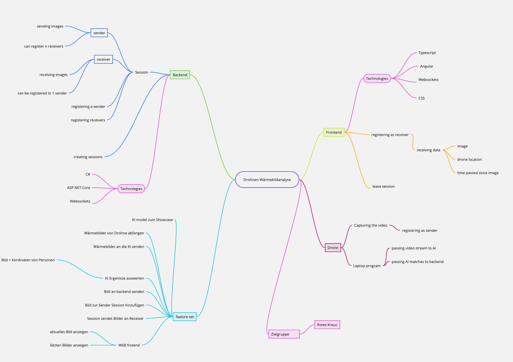

# Projektantrag - Drohnen-Wärmebildanalyse

## Planung

1. Recherche (5.11.2024)
2. Erster Prototyp (5.12.2024)

## 1. Ausgangslage

### 1.1. Ist-Situation

Das Rote Kreuz verwendet Drohnen, um vermisste Personen mithilfe von Wärmebildaufnahmen ausfindig zu machen. Die Bilder werden mittels HDMI von der Fernbedinung über einen HDMI-HUB auf Bildschirme übetragen. Dabei müssen die Piloten die Drohnen steuern und Beobachter ein aktives Auge auf die Übertragung werfen.

Die JKU hat bereits ein Projekt, das mehrere Bilder mithilfe von Integralbildtechnologie und KI analysiert und Menschen darauf ausfindig macht.

### 1.2. Verbesserungspotenziale

Es braucht ein Setup, um das KI-Model aktiv mit ihren Drohnen zu verknüpfen und mithilfe eines Web Interfaces die Auswertungen anzuzeigen. Dabei werden die Bilder von der Capture-Card zuerst an das KI-Model gesendet und im Backend verarbeitet. Die Ergebnisse werden dann im Frontend angezeigt. Dadurch wird die Personensuche effizienter und zuverlässiger, da die KI in der Lage ist, Personen zu finden, die mit dem bloßen Auge nicht zu erkennen sind.

## 2. Zielsetzung

## 3. Chancen und Risiken

### 3.1 Chancen

* Das Projekt bietet die Möglichkeit, vermisste Personen schnell und zuverlässig aufzuspüren. Mit dem Web Interface hat man eine Liste an Treffern und den dazugehörigen Koordinaten. Diese wird dann von den Helfern genutzt, um mit Suchhunden in dem jeweiligen Gebiet nach den verschwundenen Personen zu suchen. Daten werden gespeichert, bis sie zum Löschen freigegeben werden.

### 3.2 Risiken

* Technisches Realisierungsrisiko - Es kann sein, dass wir es nicht hinbekommen, die Bildübertragung der Drohne an die KI effizient anzubinden und die Auswertungen zeitgerecht an unser Web Interface auszuliefern
* Verwertbarkeitsrisiko - Vielleicht ist unsere Implementierung nicht reif genug für eine hilfreiche Unterstützung beim RK
* Aufwandsrisiko - Unter Umständen können sich die Anforderungen im Laufe der Zeit ändern

## User Stories

### Als ein: Beobachter
* Möchte ich dass: Die Bilder, die mit der Drohne aufgenommen werden, an die KI weitergeleitet werden und die resultierenden Bilder inklusive der dazugehörigen, wichtigen Metadaten auf einer Web page angezeigt werden
* Damit: Die Einsatzkräfte vollständige Aufnahmen von Personen erhalten und somit vermisste Personen leichter gefunden werden können

Akzeptanzkriterien:
1. Die Bilder werden von der Fernbedinung abgefangen und an die KI weitergegeben
2. Die KI erstellt ein Integralbild
3. Das Integralbild und die dazugehörigen Metadaten werden gespeichert
4. Die Daten werden ans Frontend geschickt
5. Das Frontend zeigt die Bilder und Koordinaten an
6. Die Übertragung kann gestartet, gestoppt und angehalten werden
7. Gespeicherte Bilder können auf Knopfdruck gelöscht werden

## Technologien

### Frontend:

- Typescript
- Angular
- Websockets
- CSS

### Backend:

- C#
- ASP.NET.Core
- Websockets

### KI-Anbindung

- C++

### Drone Video Capture

- Python